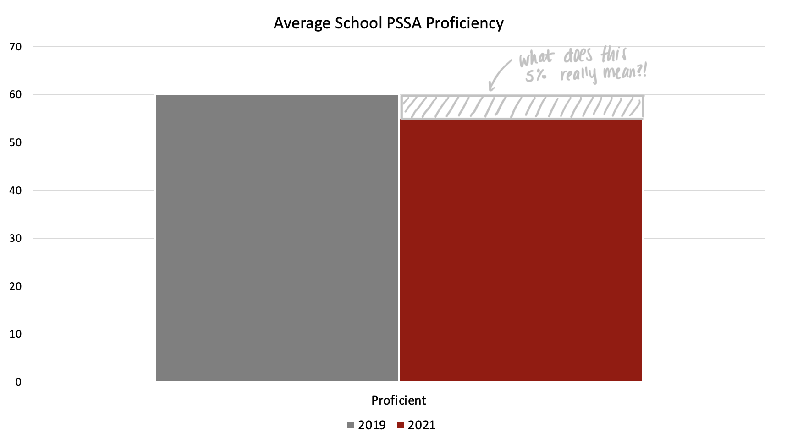
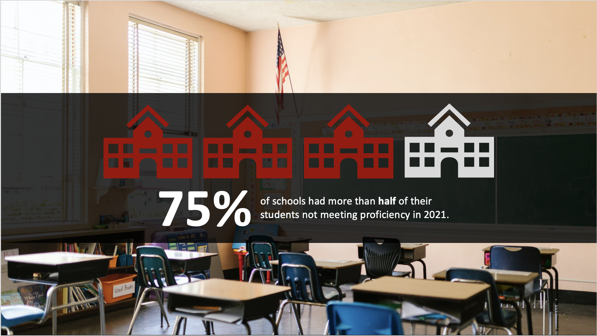
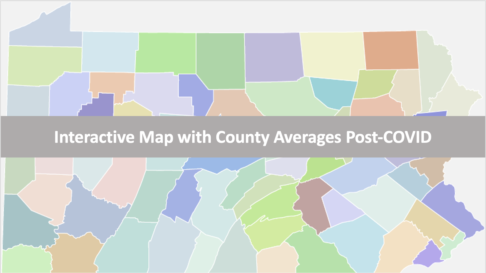
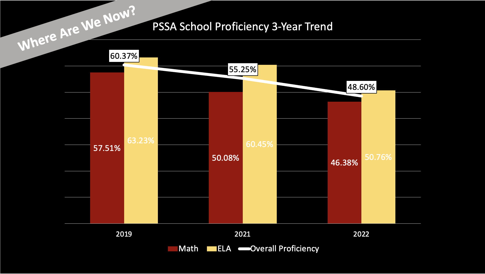

# Final Project Part 1

## Outline 
 
My final project is to show the virtual learning consequences on academic performance for third grade students in Pennsylvania. Last semester, I did an econometrics research paper that showed that student learning was negatively impacted by the lockdown, and on average, the school PSSA proficiency rates across the state declined. This paper had no visualizations aside from regression tables, so I decided to use this opportunity to create visuals that supplement my findings. Additionally, the presentation will allow me to give a quick summary to people who are interested in my findings.

My goal of this project is to show that the average school PSSA proficiency rates declined and inform my audience where we are right now in getting students back on track. Unfortunately, Pennsylvania school proficiency rates declined even further in 2022, so this will make my call to action more appealing to my audience (who will be legislators, school board members, and parents). I hope to get the main points across without my audience needing to read my 30 page paper. 

1) Average School Proficiency Rates 2019 -> 2021 (might not look so big, but hook in audience with what that 5 percentage point difference really means)
  
2) 75% of school districts in 2021 had less than half of their students meeting proficiency (this is important because that's a lot of students AND ties in to why that 5 percentage point difference is important to pay attention to)
 
3) Map of county school averages (show where your county is with proficiency. Better or worse than average?)
   
4) Where are we now? 2022 is even worse!!! (This will fuel a sense of urgency to do something about this soon, also shows by subject)

5) Call to action! (parents: advocate for legislation and find enrichment materials for your student, school board: conduct academic needs assessment and implement programs that address the needs, legislators: mandate academic needs assessment and notable budget actions that address how you will meet those academic needs (like the Kansas law))

### Initial sketches
#### 1) Average School Proficiency Rates 2019 -> 2021

#### 2) 75% of school districts in 2021 had elss than half of their students meeting proficiency.

Photo by RDNE Stock project from Pexels: https://www.pexels.com/photo/an-american-flag-inside-the-classroom-8500417/

#### 3) Map of county school averages.

awmcphee. (2021). Pennsylvania county map. Wikimedia Commons. photograph. Retrieved September 26, 2023, from https://commons.wikimedia.org/wiki/File:Pennsylvania_county_map,_cb_500k.svg. 

#### 4) Where are we now? 2022 is even worse!!!

## The data

All of my statistics come from the Pennsylvania Department of Education. Each year, they publish the PSSA scores in an Excel file and break it down by district and by school. I used the school level data to further break down the data (it was also the data I used in my research paper last semester). I also might need to add an additional data source for the county averages, but I already have that compiled from my paper (also from the PA Department of Education).
 

| Name | URL | Description |
|------|-----|-------------|
|  Department of Education School PSSA Data    |  https://www.education.pa.gov/DataAndReporting/Assessments/Pages/PSSA-Results.aspx   |  PSSA Year by Year scores           |
|  Department of Education School County Data    |  https://www.education.pa.gov/DataAndReporting/Enrollment/Pages/PublicSchEnrReports.aspx   |  Location Data           |

## Method and medium
I plan on using Shorthand for the final project. I decided on this option for two reasons: 1, I am unfamiliar with the site and think this is a good opportunity to learn something new and 2, the example projects from class looked very nice, and it looks like there is a lot of cool things to play around with. I will also use Tableau to create some visuals (unless Shorthand does this too, but I have never used it before, so I don't know).

